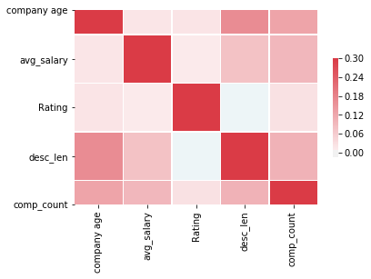
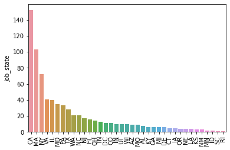

 # Data Science Salary Prediction 
 
## Project Overview
- Predicted Data Science salaries (with MAE $ 14k) which may help data scientists to understand the job market and negotiate their salaries accordingly.
- Used a Web Scraper to scrape over 1000 jobs (for US as India's Glassdoor page doesn't post salaries) using Python and Selenium.
- Feature engineering for Job text fields(description) in order to quantify the values they put on skills like Python,R,Excel,AWS and Spark.
- Optimized Linear,Lasso,RandomForest models through GridSearchCV in order to yield the best model.
- Built a client facing API through Flask framework.

 
## Resources 
- Python : 3.7
- Packages : Pandas,Numpy,scikit-learn,matplotlib,JSON,Pickle,Flask
- Web Scraper : https://github.com/arapfaik/scraping-glassdoor-selenium
- Other : https://www.youtube.com/channel/UCiT9RITQ9PW6BhXK0y2jaeg

## Web Scraping

Made changes to the web scraper (link above!) to fetch the following features for 1000 jobs posted on glassdoor.com 

- Job Title
- Salary Estimate
- Job Description
- Rating
- Company Name
- Location
- Headquarters
- Size
- Founded
- Type of ownership
- Industry
- Sector
- Revenue
- Competitors

## Data Cleaning

- Filtered out null values from the dataset.
- Created seperate columns for hourly paid salary and Employee Provided values.
- Data Parsing on Salary column.
- Added calculated fields for Min,Max and Average salary.
- Created a field to check if the state where job offered is same as the headquarters.
- Added a field to find Company's age.
- Made multiple columns to see if the skills mentioned below are mentioned in the Job Description
  - Python
  - R
  - AWS
  - Spark
  - Excel

## Exploratory Data Analysis

I looked at data distributions and below are some of the highlighting insights from the data :

## Model Building

First I transformed varaibles into dummy variables. Then, I split the data into train and test datasets with test size of 20%. I tried three different models and evaluated them through Mean Absolute Error.

- **Multiple Linear Regression** Baseline for the model
- **Lasso Regression** Used this model because of sparse data from many categorical variables.
- **Random Forest** Again because of sparsity, I considered this to be a good fit.

## Model Performance evaluation
The **Random Forest Model** outperformed amongst all the models used.

- **Random Forest** : Mean Absolute Error -  14.89
- **Multiple Linear Regression** : Mean Absolute Error - 20.77
- **Lasso Regression** : Mean Absolute Error - 21.09

## Productionizing

For this, I built a Flask API endpoint which was built on a localserver. This API endpoint takes in a request of list of values and returns an estimated salary.
